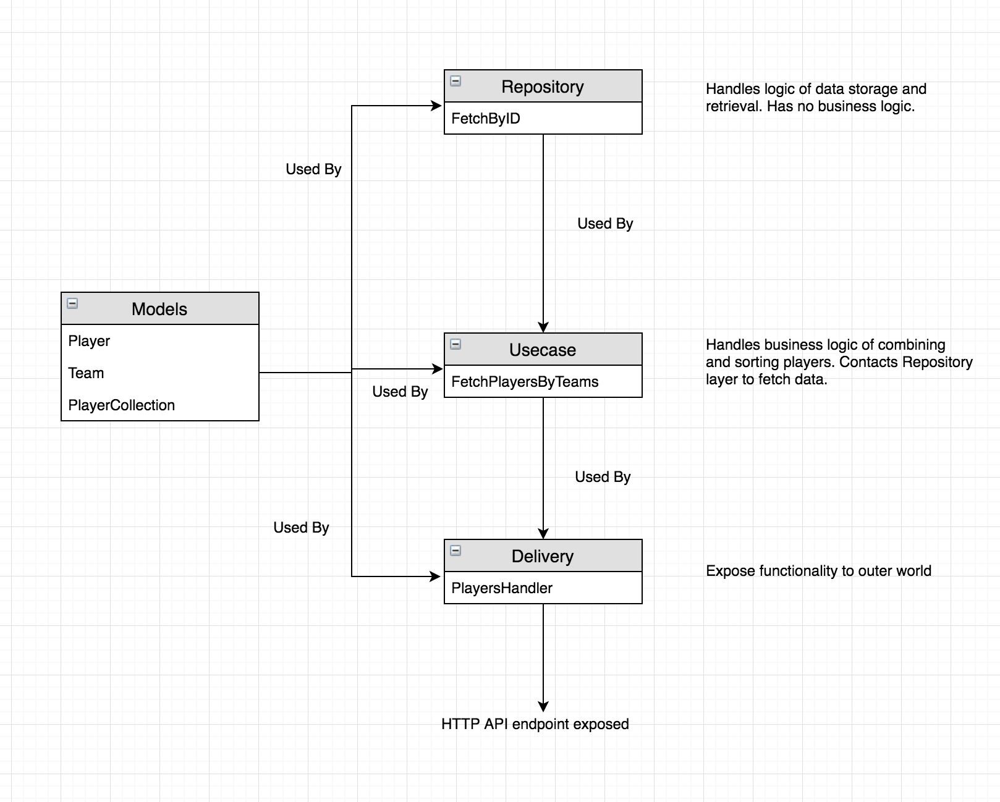

Player Service
====================

#### Endpoint 1 POST "http://localhost:8080/players"
- API endpoint for listing players from a list of hardcoded teams
- The list of players is sorted by name
- Response is in text/plain format

Architecture/ Code structure
----

The code structure for the project has it's motivation in Uncle Bob's Clean Architecture theory.

#### It tries to follow the following principles
- Independence from Frameworks - The architecture does not depend on the existence of some library. Databases/UI frameworks can be swapped easily. Business logic is independent of DB or style of exposure.
- Separation of concerns - Layers of architecture should be such that business concerns, delivery concerns and storage concerns are not intermixed.
- Individual Testable components - The business logic, http delivery logic can be tested separately.

#### 4 layered architecture
- Models - Stores the structures of data. Can be utilized in any layer.
- Repository - This layer is responsible for CRUD operations, whether from DB or another service. No business logic.
- Usecase - This layer will act as the business process handler. It decides and uses Repository layer accordingly.
- Delivery - This acts as the presenter to the outer world. Contacts Usecase layer to respond to API calls.

Details
----

#### Unit tests and code coverage
- Unit tests have been written for usecase package with 98% coverage.

#### Steps to run
- Clone this repo
- `docker-compose up`

OR

- Clone this repo
- `go get github.com/stretchr/testify`
- `go run main.go`